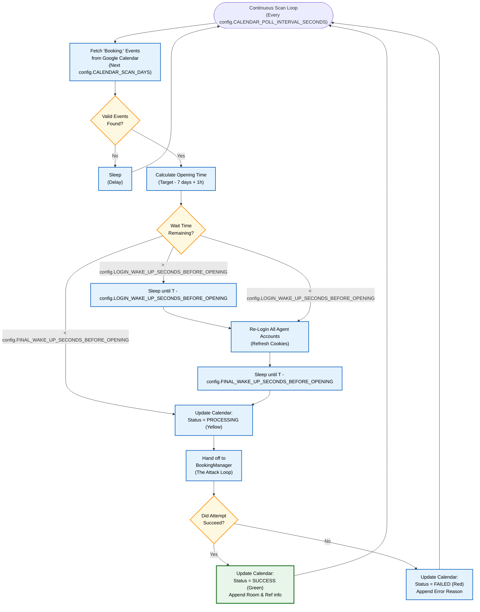
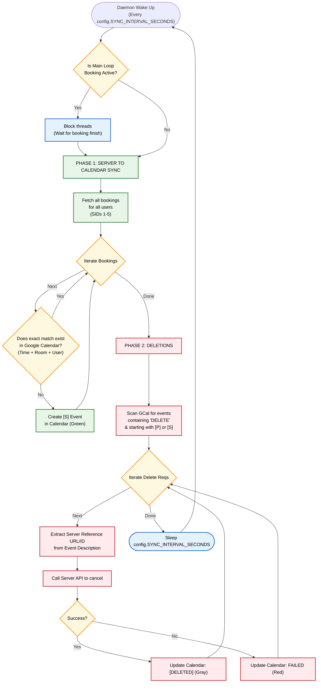

# Booking Rules & Business Logic

This document is the **Source of Truth** for all business rules, timing constraints, and logic governing the Booking Agent.

## 1. Timing & Booking Windows

### The Core Formula (7 Days - 1 Hour)
The university library system releases slots exactly 7 days in advance, but with a 1-hour positive offset. This is the critical timing constraint that drives the entire sniping strategy.

```
Opening Time = Target Slot Time - 7 Days + 1 Hour
```

**Examples:**
| Target Slot | Opens At |
|-------------|----------|
| Friday 10:00 AM | Previous Friday 11:00 AM |
| Monday 14:00 | Previous Monday 15:00 |
| Sunday 08:00 | Previous Sunday 09:00 |

### Pre-Booking Wait Strategy
When processing a booking request prior to its opening:
1.  **Initial Wait (>60s):** The system sleeps until exactly `T-60` seconds before the `Opening Time`. At this point, it wakes up and forcefully re-logs in all agents to ensure fresh session cookies and CSRF tokens.
2.  **Final Wait (<60s):** The system sleeps again until exactly `T-5` seconds.
3.  **Execution (T-5s):** The booking loop begins firing requests slightly early to account for network latency and to catch the exact millisecond the window opens.

## 2. Reservation Constraints & Limits

### Duration
*   Bookings are made in **1-hour intervals**.
*   The system treats each hour as a separate, distinct booking attempt.

### 3-Hour Maximum Rule
The library API strictly forbids any single reservation block from exceeding 3 hours.
*   **Single Event Degradation:** If a user requests a single 4-hour block (e.g., 10:00-14:00), the system automatically splits this into a `config.MAX_SINGLE_BOOKING_DURATION_HOURS`-hour sub-request (10:00-13:00) and attempts to book that first. The calendar event handles the split if successful.
*   **Combined/Merged Prevention:** The system will refuse to merge adjacent events if their combined duration would exceed the `config.MAX_SINGLE_BOOKING_DURATION_HOURS` limit.

### User Quotas
Each university account has undocumented daily and weekly booking limits. The `BookingAgent` bypasses individual limits by treating multiple accounts as a collective pool.

**Exhaustion Logic:**
*   **Detection:** The server API returns an error containing `"limited"`.
*   **Action:** The user account is marked as exhausted **for the duration of that specific booking attempt loop only**.
*   *Note: An agent is not permanently marked as "exhausted" globally. This is because a quota slot might open up later in the day due to a manual cancellation. The system must be free to try the agent again on the next booking cycle.*

### Room Priority Hierarchy
Rooms are grouped into batches to ensure the best possible locations are secured first.

*   **High Priority (Tier 1):** Rooms 108, 109, 110, 111 (IDs 125-128). Always attempted first.
*   **Low Priority (Tier 2):** Rooms 13, 14, 15, 16 (IDs 23-26). Only attempted if all High Priority rooms return conflict errors (`ROOM_TAKEN`).

## 3. High-Level Automation Cycles

The following diagrams illustrate the high-level orchestration of the system's primary cycles. For lower-level, implementation-specific flowcharts (like the attack loop retry mechanisms), see `docs/diagrams.md`.

### A. The Main Scanning Cycle (Google Calendar Input)
This loop runs continuously to find new, unprocessed booking requests added by the user to their Google Calendar.



### B. The Sync & Delete Cycle (Server Output)
This background daemon runs every 5 minutes (by default) to ensure Google Calendar accurately reflects the state of the Bookings server, and processes user deletion requests. This cycle pauses itself if the main loop is actively executing an "Attack".



## 4. Multi-Hour Logic (Splitting and Merging)

### Splitting (Degradation on Partial Success)
If a user requests a multi-hour block (e.g., 10:00-13:00) using a single calendar event, and the system fails to secure the full block but manages to book a portion of it (e.g., only 10:00-11:00):

1.  **Extract Success:** The system takes the successful 1-hour chunk, creates a *new* Green `[P]` calendar event reflecting the success.
2.  **Shift Liability:** The system shifts the original processing event's start time forward by 1 hour (now 11:00-13:00) and leaves its title as `"Booking:"` so the main scan loop picks it up on the next cycle to try again.

### Merging (Re-assembly on Consecutive Success)
After every successful booking, the system aggressively scans the calendar looking for opportunities to stitch events back together, cleaning up the user's view.

1.  **Conditions for Merge:** Two events must share the exact same booked Room Name and User Email. Furthermore, the End Time of Event A must precisely match the Start Time of Event B (with a tiny 1-minute margin of error).
2.  **Action:** The system deletes one of the events, and stretches the start/end bounds of the remaining event to cover both timeframes, updating the description to log the multiple reference IDs.
