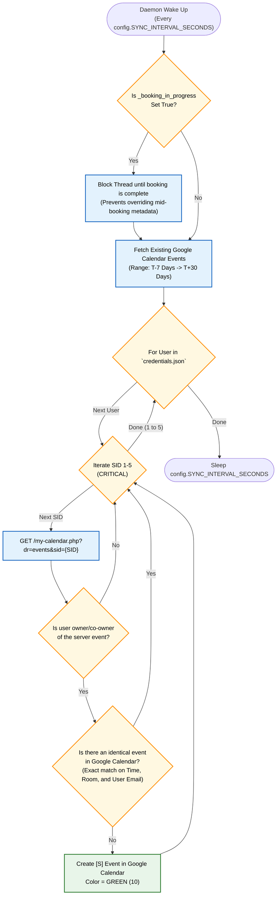
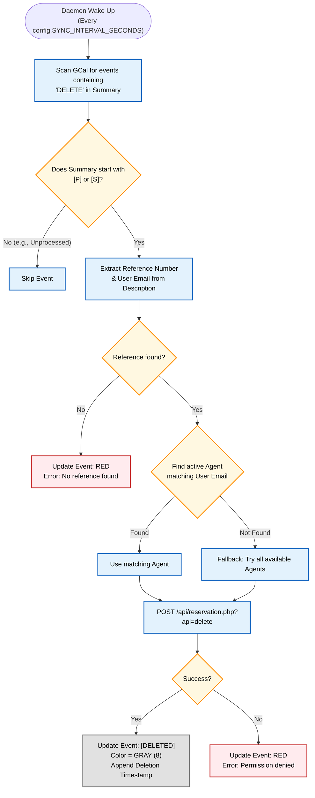

# System Diagrams

This document exists for developers to trace specific logic flows, decision trees, and error-handling mechanisms inside the Booking Agent codebase.

## 1. The Full System Flow

This flowchart encapsulates the entire lifecycle of a booking from the moment the user drops an event onto Google Calendar to the final result syncing back.

```mermaid
flowchart TD
    %% --- STYLING ---
    classDef process fill:#E3F2FD,stroke:#1565C0,stroke-width:2px,color:#000;
    classDef decision fill:#FFF8E1,stroke:#FF8F00,stroke-width:2px,color:#000;
    classDef success fill:#E8F5E9,stroke:#2E7D32,stroke-width:3px,color:#000;
    classDef fail fill:#FFEBEE,stroke:#C62828,stroke-width:2px,color:#000;

    GoogleCalendar[(Google Calendar)] -->|Every Scan Interval| SchedulerScan["Scheduler calls<br>CalendarManager.scan_for_bookings()"]:::process
    
    SchedulerScan --> ParseEvents{"Are Events valid<br>'Booking:' requests?"}:::decision
    ParseEvents -- No --> Sleep["Sleep"]:::process
    ParseEvents -- Yes --> CalcOpTime["Calculate Opening Time<br>(Start - 7d + 1h)"]:::process
    
    CalcOpTime --> Check3Hour{"Duration > config.MAX_SINGLE_BOOKING_DURATION_HOURS?"}:::decision
    Check3Hour -- Yes --> SplitRequest["Split Request<br>(Keep first config.MAX_SINGLE_BOOKING_DURATION_HOURS h)"]:::process
    Check3Hour -- No --> ReadyWait{"Wait for<br>Opening Time"}:::decision
    SplitRequest --> ReadyWait
    
    ReadyWait -- "T-(config.LOGIN_WAKE_UP_SECONDS_BEFORE_OPENING) -> T-(config.FINAL_WAKE_UP_SECONDS_BEFORE_OPENING)" --> LockThread{"Acquire <br>_booking_in_progress <br>Thread Lock"}:::decision
    
    LockThread -- Locked --> MarkYellow["Update Event: PROCESSING (Yellow)"]:::process
    MarkYellow --> FireLoop["Call BookingManager.attempt_booking()"]:::process
    
    FireLoop --> StartLoop[[Start The Attack Loop]]:::process
    StartLoop --> RoomLoop{"Iterate Rooms<br>(High Priority -> Low Priority)"}:::decision
    RoomLoop -- Next Room --> CheckRoomFailed{"Is Room in failed list?"}:::decision
    CheckRoomFailed -- Yes --> RoomLoop
    CheckRoomFailed -- No --> AgentLoop{"Iterate Agents<br>(Prioritize Last Successful)"}:::decision
    
    AgentLoop -- Next Agent --> API["POST /api/reservation.php?action=create"]:::process
    API --> ResCheck{"Response Status?"}:::decision
    
    ResCheck -- "ROOM_TAKEN<br>('conflicting')" --> MarkFailRoom["Add Room to failed list"]:::process
    MarkFailRoom --> RoomLoop
    
    ResCheck -- "USER_LIMIT<br>('limited')" --> MarkE["Add Agent to exhausted list"]:::process
    MarkE --> AgentLoop
    
    ResCheck -- "TOO_EARLY<br>('this far in future')" --> SleepHalf["Sleep config.BOOKING_RETRY_INTERVAL_SECONDS"]:::process
    SleepHalf --> API
    
    ResCheck -- "TIMEOUT (>config.BOOKING_TIMEOUT_SECONDS)" --> FailResult["Return FAILED"]:::fail
    
    AgentLoop -- "Done (All Agents Failed)" --> RoomLoop
    RoomLoop -- "Done (All Rooms Failed)" --> FailResult
    
    ResCheck -- "SUCCESS" --> SuccessResult["Return SUCCESS"]:::success
    
    SuccessResult --> CalendarResult{"Result Handler"}:::decision
    FailResult --> CalendarResult
    
    CalendarResult -- "SUCCESS" --> SplitCheck{"Was this a partial success?<br>(Duration < Requested)"}:::decision
    CalendarResult -- "FAILED" --> UpdateRed["Update Event: RED + Error"]:::fail
    
    SplitCheck -- No --> UpdateGreen["Update Event: GREEN<br>+ Ref ID/Room"]:::success
    SplitCheck -- Yes --> SliceEvent["Create 1hr GREEN event.<br>Shift original YELLOW event<br>forward 1hr."]:::process
    
    UpdateRed --> ReleaseLock
    UpdateGreen --> CheckMerge{"Are there adjacent<br>successful bookings?"}:::decision
    CheckMerge -- Yes --> Merge["Merge continuous events<br>into one block"]:::process
    CheckMerge -- No --> ReleaseLock
    SliceEvent --> ReleaseLock
    Merge --> ReleaseLock
    
    ReleaseLock{"Release<br>_booking_in_progress<br>Lock"}:::decision --> SyncWait["Wait for next Sync Daemon Cycle"]:::process
```

## 2. Server to Calendar Sync Mechanism

This diagram specifically details how the `CalendarSync._sync_worker` ensures the server logic remains perfectly synchronized with the user's Google Calendar.

## 3. The DELETE Mechanism

This diagram details the flow when the user cancels an event via Google Calendar.

