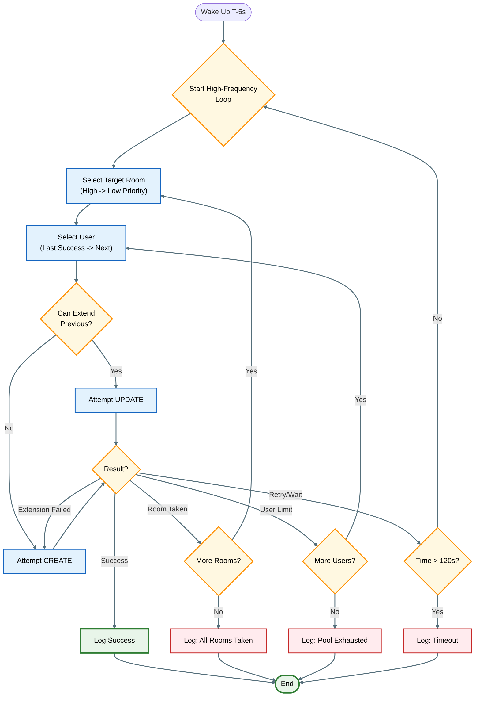

# System Logic: Technical Deep Dive

This document details the internal algorithms, decision trees, and error-handling mechanisms of the Booking Agent. For high-level constraints, see [Booking Rules](booking_rules.md).

## 1. The "Sniper" Algorithm

The system does not simply "try to book". It calculates the exact millisecond a window opens and executes a synchronized attack.

### Preparation Phase
1.  **Target Calculation**: The `Scheduler` iterates through `bookings.json`, filters out past/completed slots, and identifies the slot with the *earliest* opening time.
2.  **The Wait**:
    *   **Long Sleep**: If the target is > 60 seconds away, the process sleeps until `T - 60s`.
    *   **Wake & Sync**: At `T - 60s`, the system wakes up and **re-authenticates the entire user pool** to ensure fresh cookies/sessions.
    *   **Precision Sleep**: It then enters a final sleep until `T - 5s` (5 seconds before opening) to account for any network latency or clock drift.

### The Attack Loop
At `T - 5s`, the system initiates the request loop. This loop runs at maximum speed until success or timeout.

*   **Concurrency**: The system is single-threaded for the *booking logic* to effectively manage state (room availability/user quotas) but uses multi-threading for the initial *login phase*.
*   **Retry Strategy**: If an attempt fails due to "Window Not Open Yet" (common in the first few seconds), it sleeps for `0.5s` and retries immediately.

## 2. Decision Logic & Coping Mechanisms

The system employs a specific hierarchy to handle dynamic failures.

### A. Room Exhaustion Handling
*   **Logic**: The system iterates through rooms in strict order: `High Priority Batch` -> `Low Priority Batch`.
*   **Coping**: If a server response indicates `ROOM_TAKEN` (Conflict), the system **immediately abandons** that specific room ID and moves to the next iterator. It does *not* retry the same room.

### B. User Quota Handling
*   **Logic**: The system maintains a `set` of specific users who have returned `USER_LIMIT` errors for the current slot.
*   **Coping**:
    *   If Agent A returns `USER_LIMIT`, Agent A is added to the "Exhausted" set.
    *   The loop continues to Agent B *without changing the room*.
    *   The priority is always **Last Successful User** -> **Next Available User**.

### C. Consecutive Booking Optimization
Before sending a `create` request, the system checks `booking_history.json`:
*   **Condition**: Is there a successful booking for [Same User] + [Same Room] ending at [Current Start Time]?
*   **Action**: If yes, send `api/reservation.php?action=update` to **extend** the end time instead of creating a new ID.
*   **Fallback**: If the extension fails (e.g., total duration limit), the system catches the error and immediately falls back to the standard `create` flow.

### D. Timeout Safety
*   **Hard Limit**: If the loop runs for more than **120 seconds**, the system assumes all resources are gone or the system is down. It aborts to prevent an infinite loop and logs a `Timeout` failure.

## 3. Visual Logic Flow

