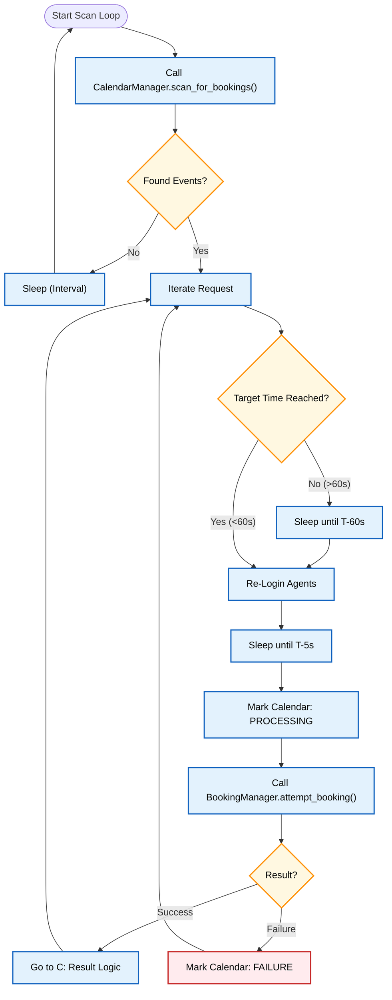
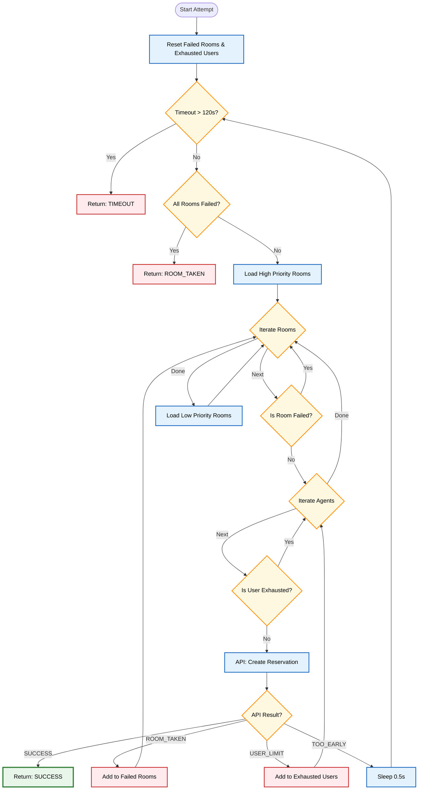
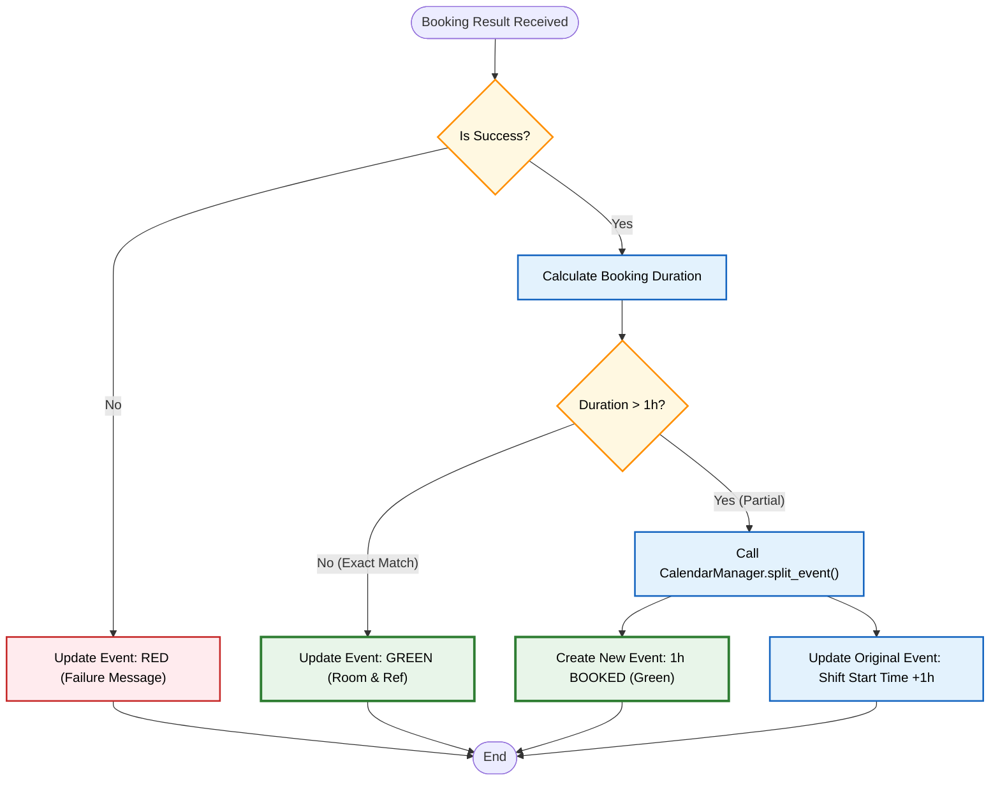

# System Logic: Technical Deep Dive

This document details the internal algorithms, decision trees, and error-handling mechanisms of the Booking Agent.

## 1. The Booking Lifecycle

The system operates on a continuous scanning loop driven by the `Scheduler`, delegating specific tasks to specialized Services (`CalendarManager`, `BookingManager`, `AgentManager`).

### Phase 1: Discovery (CalendarScanning)
1.  **Poll**: The `Scheduler` triggers `CalendarManager.scan_for_bookings()` every few seconds.
2.  **Filter**: It looks for "Booking" events in the next `CALENDAR_SCAN_DAYS`.
3.  **Parse**: Converts event times to `BookingRequest` objects, calculating the target `opening_time` (7 days prior + 1 hour).
4.  **Ready Check**: The Scheduler processes requests that are currently valid or opening soon.

### Phase 2: Orchestration
1.  **Status Update**: The event on Google Calendar is marked as **PROCESSING** (Yellow).
2.  **Execution**: The `Scheduler` passes the request to `BookingManager.attempt_booking`.

### Phase 3: The Attack Loop (BookingManager)
The `BookingManager` executes a high-frequency loop to secure the slot:

1.  **Room Strategy**: Iterates through **High Priority** rooms first, then **Low Priority**.
2.  **Agent Strategy**: Uses `AgentManager` to retrieve a pool of authenticated agents.
    -   *Logic*: Can prioritize the "Last Successful User" to maintain session persistence.
    -   *Rotation*: If a user hits a quota (`USER_LIMIT`), they are temporarily removed from the pool for this attempt.
3.  **Retry Mechanism**:
    -   **TOO_EARLY**: If the window isn't open yet, it retries immediately (effectively "waiting" for the millisecond it opens).
    -   **ROOM_TAKEN**: Immediately switches to the next room in the priority list.
    -   **Timeout**: Aborts after 120 seconds to prevent infinite loops.

## 2. Decision Logic & Error Handling

### A. Room Priority & Exhaustion
*   **Structure**: Rooms are grouped into Batches (High vs Low).
*   **Flow**: `(High Room 1 -> High Room 2 -> ...) -> (Low Room 1 -> ...)`
*   **Constraint**: If a room returns `ROOM_TAKEN`, it is marked as failed for this attempt and skipped by subsequent agents.

### B. User Quota Management
*   **Detection**: Server returns error `"user has reached their booking limit"`.
*   **Action**: The `BookingManager` adds the agent's email to an `exhausted_emails` set.
*   **Result**: The loop continues with the next available agent for the *same* room (if not taken) or next room.

### C. Multi-Hour Logic (Splitting)
*   **Scenario**: User requests a 2-hour block (e.g., 10:00-12:00), but only 10:00-11:00 is successfully booked.
*   **Action**:
    1.  `BookingManager` returns success for the first hour.
    2.  `Scheduler` detects the duration difference.
    3.  `CalendarManager.split_event()` is called:
        -   Creates a **Success** event for 10:00-11:00 (Green).
        -   Updates the original "Booking" event to start at 11:00 (remains actionable).

## 3. Visual Logic Flow

### A. Orchestration Flow (Scheduler)

This diagram illustrates how the Scheduler discovers and dispatches booking requests.

### B. Booking Loop (BookingManager)

This diagram details the core "attack" logic, including retry mechanisms and error handling.

### C. Result & Split Logic (Post-Booking)

This diagram shows how the system handles the result of a booking attempt, specifically focusing on multi-hour event splitting.

