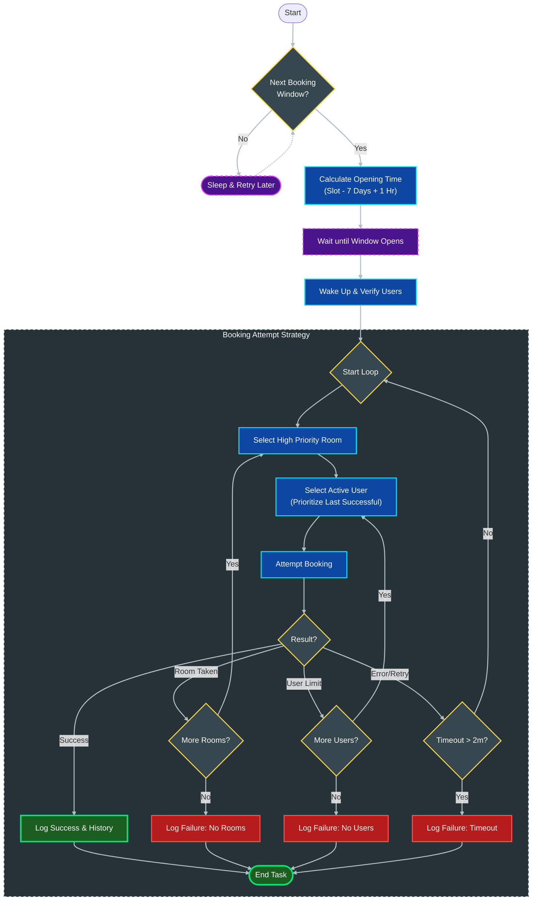

# System Logic & Decision Flow

## 1. Booking Requirements
The system is designed to secure high-demand library rooms by acting faster than human users. To successfully make a booking, the following conditions must be met:

*   **Valid Credentials**: The system must have a pool of active user accounts (to bypass individual booking limits).
*   **Target Timing**: The booking attempt must occur the moment the reservation window opens.
*   **Resource Availability**: At least one desired room must be free (unbooked) at that time.

## 2. When to Book (The "Sniping" Window)
The system calculates the optimal booking time based on the university's release schedule:
*   **Rule**: A reservation slot for `Day X` at `Time T` becomes available for booking exactly **7 days prior** at `Time T + 1 hour`.
    *   *Example*: To book a room for **Friday at 10:00 AM**, the system must attempt the booking on the **previous Friday at 11:00 AM**.

## 3. Execution Logic (The Algorithm)

The system follows a strict, tiered decision process to maximize the chance of success.

### A. Preparation Phase
1.  **Identify Targets**: Scan the desired schedule and find the next upcoming booking window.
2.  **Wait**: Sleep until 1 minute before the window opens.
3.  **Verify Setup**: Wake up, log in all users to ensure sessions are active, and synchronize the internal clock.
4.  **Final Countdown**: Wait until **5 seconds before** the official opening time (to account for network latency).

### B. The Booking Loop ("Attack")
Once the window opens, the system enters a high-speed loop:

1.  **Prioritize Rooms**:
    *   First, attempt to book **High Priority Rooms** (Tier 1).
    *   If all Tier 1 rooms are taken, fall back to **Low Priority Rooms** (Tier 2).

2.  **Prioritize Users (Agents)**:
    *   Start with the **Last Successful User** (the account that made the most recent successful booking).
    *   If that user fails (e.g., quota reached), rotate through the remaining pool of users.

### C. Failure Handling

*   **Scenario: "User Limit Reached"**
    *   *Condition*: The current user account has already booked its maximum allowed hours for the day/week.
    *   *Action*: The system **swaps to the next user in the pool** and immediately retries the *same room* and *same slot*. This ensures the opportunity isn't lost due to one user's limits.

### D. Booking vs. Extending
*   **Logic**: Before creating a new booking, the system checks if the *same user* has a consecutive booking (ending exactly when the new slot starts) in the *same room*.
*   **Action**:
    *   **Extending**: If a consecutive booking exists, send an `update` request to extend the end time of the existing reservation.
    *   **New Booking**: If no consecutive booking exists (or the update fails), send a standard `create` request.

*   **Scenario: "Room Taken"**
    *   *Condition*: The specific room is already booked by someone else.
    *   *Action*: The system **abandons that room** and immediately attempts the next room in the priority list.

*   **Scenario: "Pool Exhausted"**
    *   *Condition*: Every single user in the pool has reached their booking limit.
    *   *Action*: The booking attempt for this slot is marked as **FAILED** and abandoned.

*   **Scenario: "Timeout"**
    *   *Condition*: 2 minutes have passed since the window opened without success.
    *   *Action*: The attempt is aborted to prevent indefinite looping (the rooms are likely all gone).

## 4. Visual Logic Flow

